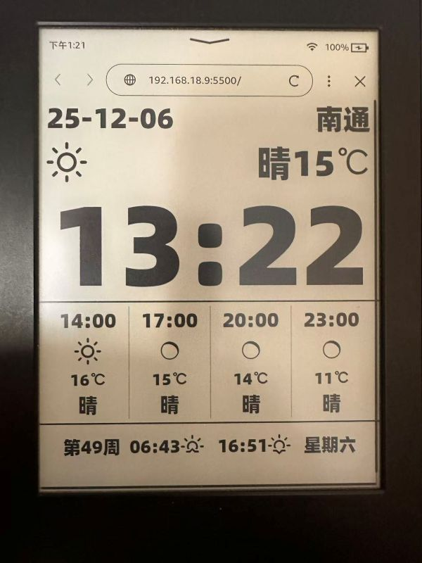
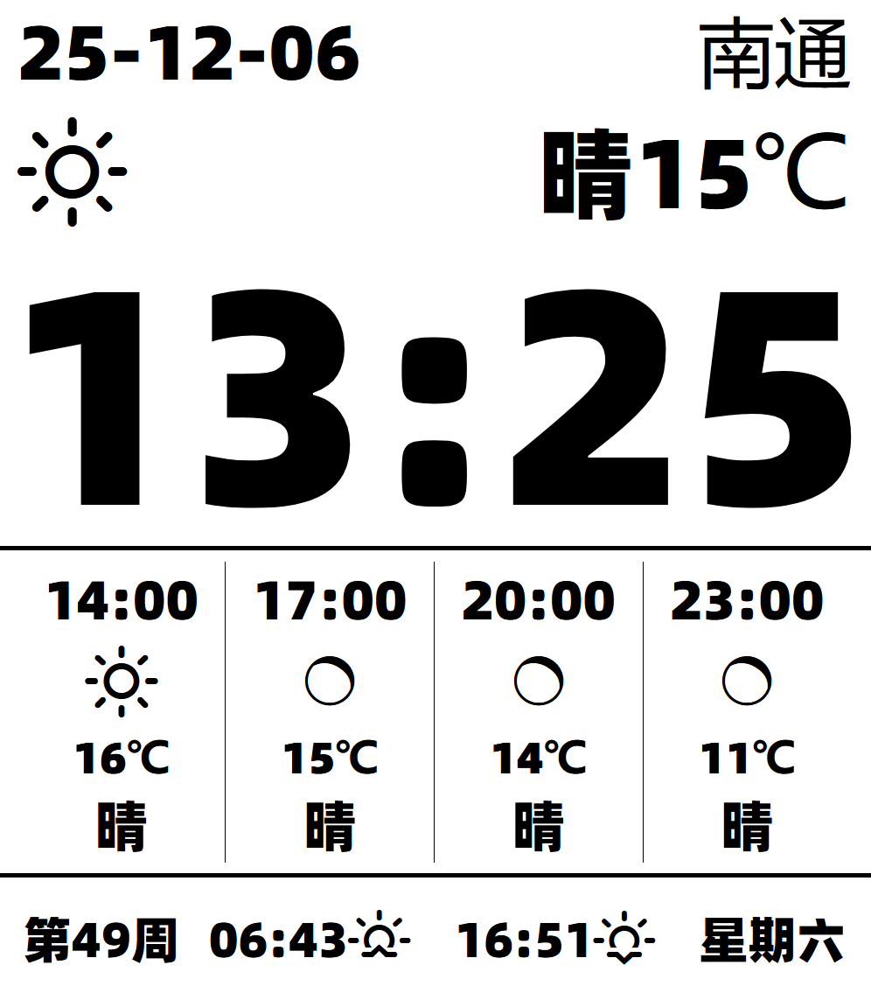
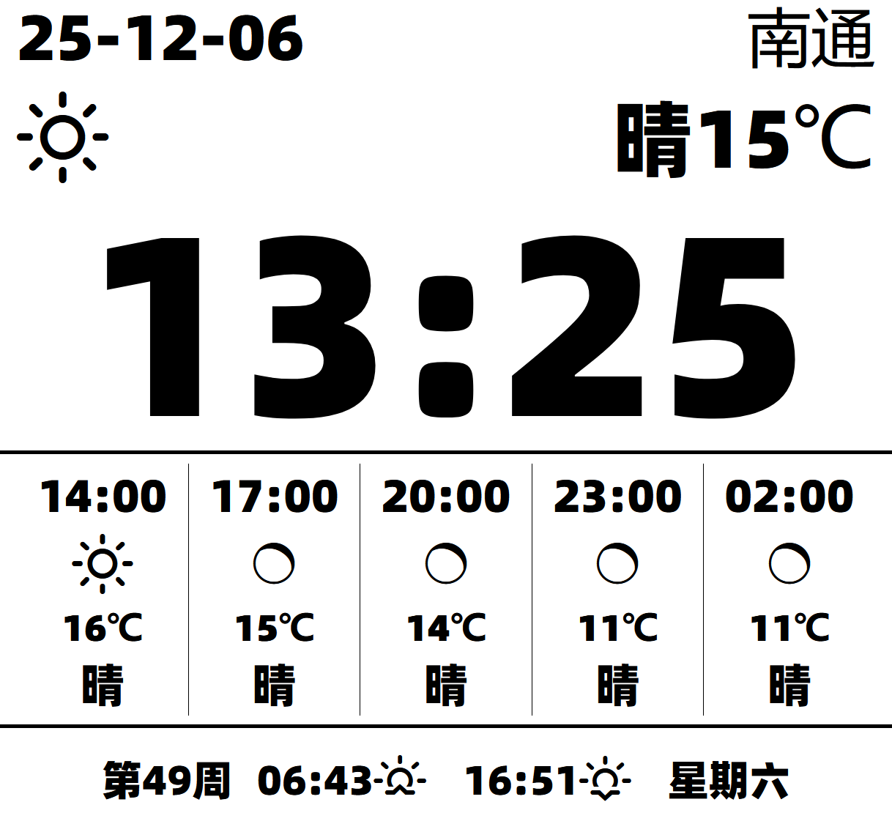

# Kindle 时钟和天气预报

Kindle 中文台历系统
原理：利用 Kindle 的内置浏览器 访问 H5 页面

注：参考原作：https://github.com/0111/Kindle_WeatherCN

手里是一台 7 代的 Kindle，在显示原作时页面有些超出屏幕范围，因此手动改造了一版。

相对原作主要改动如下：

- 大幅修改了 kindle.css，去掉了所有定位布局系统，换成了 webkit 版的 flexbox（老 kindle 内置浏览器不支持现代 flexbox）；
- 重新制作了字体，基于阿里巴巴普惠体，工具和方法放在./fontTool
- 修改了日期、城市和当前天气的显示

## 第一步：关闭屏幕休眠模式

最新的 kindle 系统已经无法在搜索框中输入： ～ ds 来关闭屏保，必须越狱。

- 安装 WinterBreak
- 安装 KUAL 和 KUAL Helper

操作参考：

- https://bookfere.com/post/406.html
- https://bookfere.com/post/1145.html
- https://bookfere.com/post/311.html
- https://bookfere.com/post/477.html

## 第二步：用 kindle 浏览器打开测试网站

访问页面 https://linliwan.github.io/kindle_clock/

## 备注

config.js 中 cityNameDB 收录了 60 多个知名城市，如果自己所在的城市未列入，则右上角会显示拼音，可以自行添加自己城市的中文名到 cityNameDB。

## 效果图

